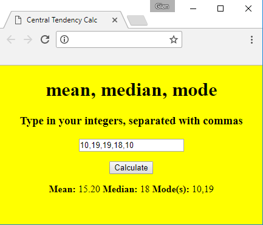

# MCTCalc
A calculator that computes the measures of central tendency of a group of integers

## Pre-requisites and Requirements
- Web browser (recommended: Firefox, Chrome, Safari)
- Measures of Central Tendency: Mean is the "fancy" word for "average", Median is the middle-most number, Mode(s) is/are the number(s) that occur most in the set of numbers

## Screenshots

## Instructions
Click <a href="http://htmlpreview.github.io/?https://github.com/techGIAN/MCTCalc/blob/master/index.html">here</a> to view

## License
**MIT License**  
A short and simple permissive license with conditions only requiring preservation of copyright and license notices. Licensed works, modifications, and larger works may be distributed under different terms and without source code.

## Some Sources
- https://khan4019.github.io/front-end-Interview-Questions/sort.html
- https://www.sitepoint.com/community/t/calculating-the-average-mean/7302/3
